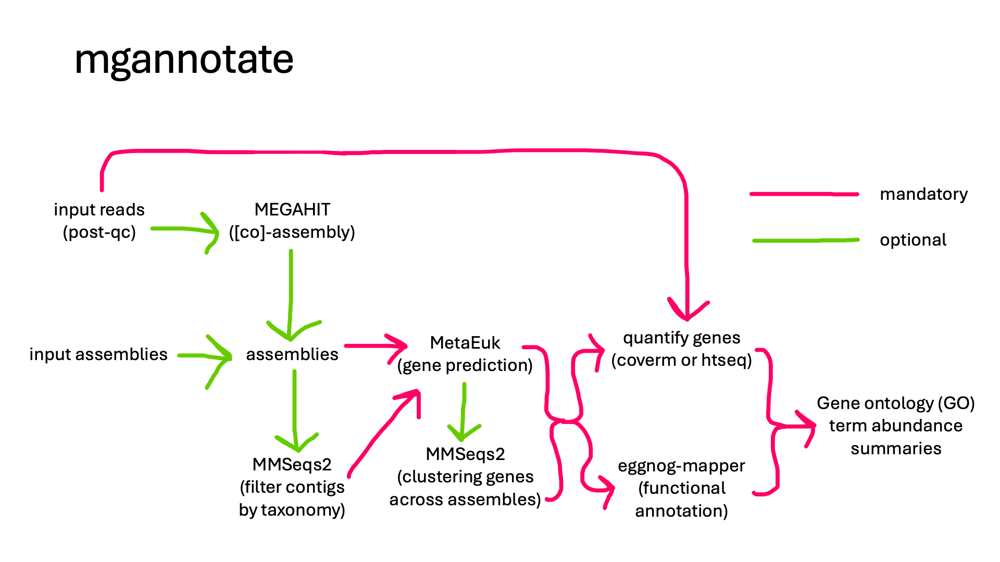

## Introduction

**prototaxites/mgannotate** is a bioinformatics pipeline that predicts genes in metagenome assemblies, annotates them, and produces a high-level summary of GO terms within them.

## Pipeline summary

Currently, the pipeline performs the following: 

* (optional) (co-)assembles metagenome shotgun short reads with [MEGAHIT](https://github.com/voutcn/megahit)
* (optional) filters assembled contigs to remove or keep specific clades using [MMSeqs](https://github.com/soedinglab/MMseqs2/)
* Predicts of protein-coding genes using [MetaEuk](https://github.com/soedinglab/metaeuk)
* (optional) clustering of genes using [MMSeqs](https://github.com/soedinglab/MMseqs2/)
* Annotates predicted genes using [eggnog-mapper](https://github.com/eggnogdb/eggnog-mapper)
* Counts reads mapping to each gene using either [HTSeq-count](https://github.com/htseq/htseq) or [CoverM](https://github.com/wwood/CoverM)
* Produces count summaries for each GO in a provided list

## Pipeline diagram



## Usage

The pipeline can be run with the following command:

```
nextflow run prototaxites/mgannotate \
    -profile <docker/singularity/podman/shifter/charliecloud/conda> \
    --reads <samplesheet_reads.csv> \
    --outdir <OUTDIR>
```

### Input 

#### Sequencing data

Input of sequencing data is via csv files, containing paths and associated metadata:

* `--reads` is a csv file with the following headers: `sampleid,assemblyid,forward_reads,reverse_reads`
* `--assemblies` is a csv file with the following headers: `assemblyid,assembler,path`

Where:

* `forward_reads`, `reverse_reads`, and `path` are the paths to the forward reads fastq, reverse reads fastq, and assembly fasta, respectively. Reverse reads are optional, but if using co-assembly, all reads for a given `assemblyid` must be paired or single-end only.
* `assemblyid` is the unique identifier of the assembly. If `--assemblies` is provided, coverage for each reads entry mapping to an `assemblyid` is estimated individually. If no `--assemblies` is provided, `assemblyid` is used to group reads for co-assembly.
* `sampleid` is a unique identifier for each shotgun sequencing sample.

Options for input are as follows:

* `--reads` only: Pipeline will perform denovo assembly of shotgun reads
* `--assemblies` only: Pipeline will annotate assemblies but not estimate gene or GO abundances
* `--reads` and `--assemblies`: Pipeline will annotate assemblies and estimate gene and GO abundances

#### Databases

The pipeline requires three databases for full functionality. If they are not provided, the steps requiring the databases will not be run.

* Taxonomic database (MMSeqs format):
    - This should be an MMSeqs database with taxonomic annotations. Can be provided either as a string with `--mmseqs_tax_db` with the names of one of the databases available at the [MMSeqs2 documentation](https://github.com/soedinglab/MMseqs2/wiki#downloading-databases), in which case it is downloaded, or as a path to a pre-downloaded local database with `--mmseqs_tax_db_local`.
* Functional database (MMSeqs format):
    - This should be an MMSeqs database to use for gene predictions with MetaEuk. Can be provided either as a string with `--mmseqs_func_db` with the names of one of the databases available at the [MMSeqs2 documentation](https://github.com/soedinglab/MMseqs2/wiki#downloading-databases), in which case it is downloaded, or as a path to a pre-downloaded local database with `--mmseqs_func_db_local`. If the eggnog-mapper MMSeqs2 database has been pre-downloaded, the path to this could also be provided.
* eggnog-mapper database:
    - Path to a directory containing the eggnog-mapper database. If not provided, the eggnog-mapper database will be automatically downloaded - this can be saved by supplying `--save_eggnog_db`. Can be downloaded following the instructions provided in the [eggnog-mapper documentation](https://github.com/eggnogdb/eggnog-mapper/wiki/eggNOG-mapper-v2.1.5-to-v2.1.12#user-content-Setup). When downloading the database, make sure to enable downloading the MMSeqs2 database with the `-M` flag as this is what is presently use by the pipeline. 

## Pipeline flags

Some important pipeline flags to enable specific modes:

* `--filter_contigs`: Enable taxonomic filtering of assembly contigs using the taxids specified in `--filter_taxon_list`.
* `--cluster_genes`: Before annotation, take the gene predictions from all assemblies and cluster them together into one gene catalogue. Reads mapping to the genes are then counted using CoverM.
* `--assemblies_are_genes`: It is possible to skip gene prediction and provide a fasta file of gene sequences instead of metagenome assemblies. Must be used in conjunction with `--cluster_genes` as there is no GFF file to map with using HTSeq-Count.

## Pipeline output

The output folder (`--outdir`) contains the following directories:

* `assemblies/{assemblyid}`: denovo assembly fasta files
* `annotations`:
    - `metaeuk/{assemblyid}/`: MetaEuk protein and nucleotide fasta files of predicted genes, and GFF files
    - `eggnog-mapper/{assemblyid}/`: eggnog-mapper annotation files
    - `clusters/`: if using gene clustering, the fasta and cluster identities from MMSeqs clustering.
* `coverage/`: Read counts per gene, with eggnog-mapper annotations, and GO summaries per sample.
* `GO_df_long.csv`: GO summaries for all samples merged into one summary file
* `taxonomy/{assemblyid}_taxdb/`: MMseqs taxonomy DBs for the unfiltered assemblies.

## Attribution

This pipeline uses code and infrastructure developed and maintained by the [nf-core](https://nf-co.re) community, reused here under the [MIT license](https://github.com/nf-core/tools/blob/master/LICENSE).
 
> The nf-core framework for community-curated bioinformatics pipelines.
>
> Philip Ewels, Alexander Peltzer, Sven Fillinger, Harshil Patel, Johannes Alneberg, Andreas Wilm, Maxime Ulysse Garcia, Paolo Di Tommaso & Sven Nahnsen.
>
> Nat Biotechnol. 2020 Feb 13. doi: 10.1038/s41587-020-0439-x.
> In addition, references of tools and data used in this pipeline are as follows:
